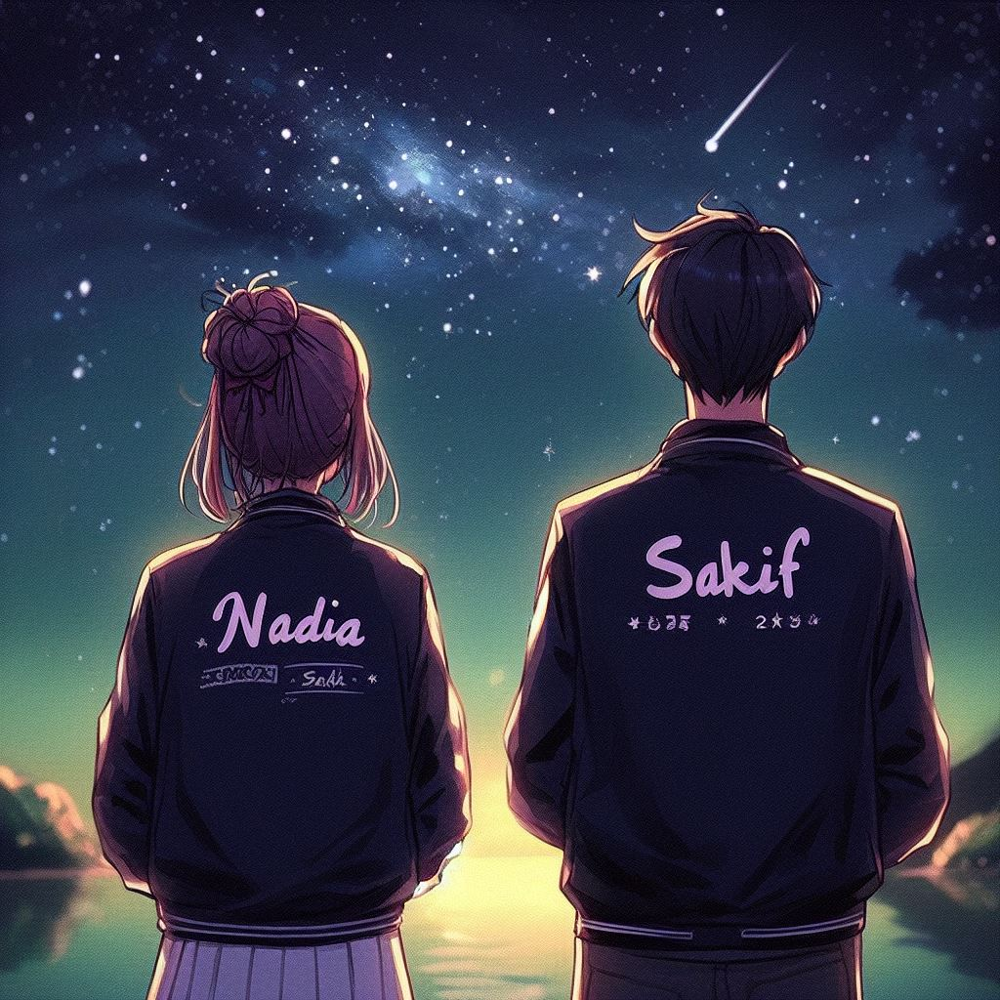
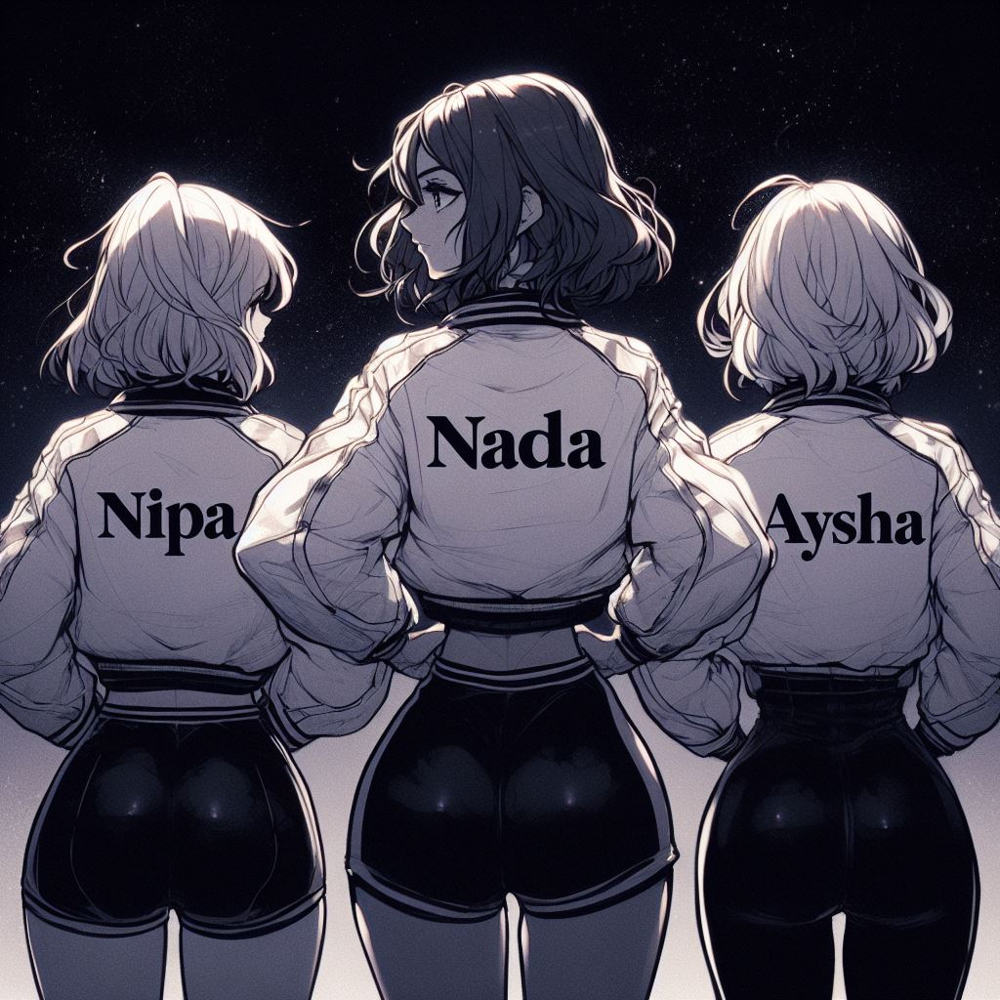
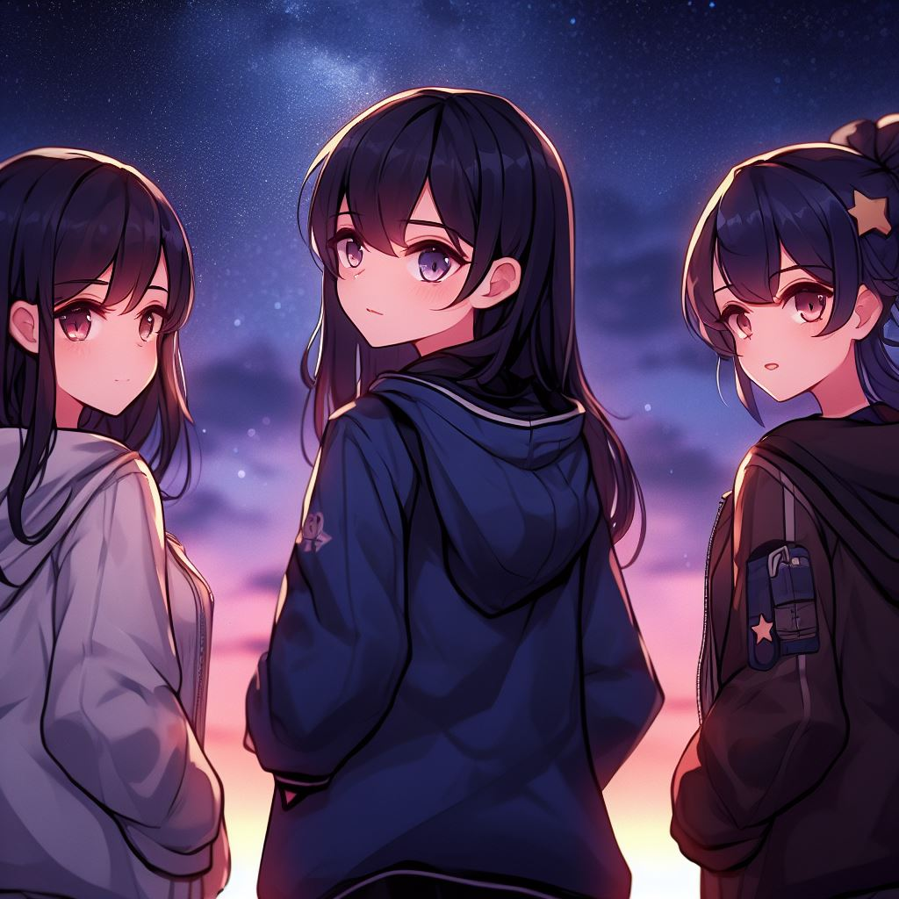

# first-ever-image-generation

>I have used Bing Image Creator.

### 1st prompt:
```
bf and gf looking at the beautiful night sky. The word "Nadia" is written On the girlfriends back of the jacket and the word "Sakif" is written on the back of the boyfriends back of the jacket.

in a good looking anime style.
```
### Output:
| Image 1 | Image 2 |
|---|---|
|  |  |
| Image 3 | Image 4 |
|  | null |


### 2nd prompt:
```
bf and gf looking at the beautiful night sky. The word "NADIA" is written On the girlfriends back of the jacket and the word "SAKIF" is written on the back of the boyfriends back of the jacket.

in a good looking anime style.
```
### Output:
| Image 1 | Image 2 |
|---|---|
|  |  |
| Image 3 | Image 4 |
|  |  |


### 3rd prompt:
```
bf and gf looking at the beautiful night sky. The word "NIPA" is written On the girlfriends back of the jacket and the word "RANA" is written on the back of the boyfriends back of the jacket.

in a good looking anime style.
```
### Output:
| Image 1 | Image 2 |
|---|---|
|  |  |
| Image 3 | Image 4 |
|  | null |


### 4th prompt:
```
Three female friends, "NADIA", "NIPA", and "AYSHA", stand in a row, gazing up at the starlit sky. Nadia, the shortest of the three, is flanked by Nipa and Aysha. Their jackets bear their respective names. The girls hold hands, their silhouettes etched against the celestial backdrop.

In a good anime style.
```
### Output:
| Image 1 | Image 2 |
|---|---|
|  |  |
| Image 3 | Image 4 |
|  |  |


### 5th prompt:
```
Three anime-style female friends, Nadia, Nipa, and Aysha, stand together admiring the night sky. Nadia, the middle one, is slightly shorter than the other two. All three wear jackets, with their names written on the backs. Nadia's jacket says "NADIA," Nipa's says "NIPA," and Aysha's says "AYSHA." Nipa and Aysha hold Nadia's hands.
```
### Output:
| Image 1 | Image 2 |
|---|---|
|  |  |
| Image 3 | Image 4 |
|  | null |


### 6th prompt:
```
Three anime-style female friends, Nadia, Nipa, and Aysha, stand together admiring the night sky. Nadia, the middle one, is slightly shorter than the other two. All three wear jackets, with their names written on the backs. Nadia's jacket says "NADIA," Nipa's says "NIPA," and Aysha's says "AYSHA." Nipa and Aysha hold Nadia's hands.

The middle one should be nadia.
```
### Output:
| Image 1 | Image 2 |
|---|---|
|  |  |
| Image 3 | Image 4 |
|  |  |


### 7th prompt:
```
Three anime-style female friends, Nadia, Nipa, and Aysha, stand together admiring the night sky. Nadia, the middle one with the name "NADIA" on her jacket, is slightly shorter than the other two. Nipa and Aysha wear jackets with their names, "NIPA" and "AYSHA," respectively. Nipa and Aysha hold Nadia's hands.
```
### Output:
| Image 1 | Image 2 |
|---|---|
|  |  |
| Image 3 | Image 4 |
|  | null |


### 8th prompt:
```
Three anime-style female friends, Nipa, Nadia, and Aysha, stand together, their gazes captivated by the breathtaking night sky. Nadia, the middle figure, occupies the heart of the scene, her jacket emblazoned with the name "NADIA." Flanked by her companions, Nipa and Aysha, each adorned with their respective jackets bearing their names - "NIPA" and "AYSHA" - the trio stands in perfect unity, their hands intertwined in a gesture of friendship and shared wonder.
```
### Output:
| Image 1 | Image 2 |
|---|---|
|  |  |
| Image 3 | Image 4 |
|  |  |


### 9th prompt:
```
Three anime-style female friends, Nadia, Nipa, and Aysha, stand together, their eyes fixed upon the captivating beauty of the night sky. Nadia, the central figure, her jacket proudly displaying the name "NADIA" across the back, stands in perfect harmony between her companions, Nipa and Aysha. Their jackets, too, bear their respective names - "NIPA" and "AYSHA" - emblazoned on the backs, creating a visual symphony of friendship and shared admiration.
```
### Output:
| Image 1 | Image 2 |
|---|---|
|  |  |
| Image 3 | Image 4 |
|  | null |


### 10th prompt:
```
Three anime styled female friends Nipa, Nadia and Aysha looking at the beautiful night sky, wearing jackets, dark hair.
"NIPA", "NADIA" and "AYSHA" is written on the back of their jacket.
```
### Output:
| Image 1 | Image 2 |
|---|---|
|  |  |
| Image 3 | Image 4 |
|  |  |


### 11th prompt:
```
Three anime styled female friends Nipa, Nadia and Aysha looking at the beautiful night sky, wearing jackets, dark long hair.
"NIPA", "NADIA" and "AYSHA" is written on the back of their jacket.
```
### Output:
| Image 1 | Image 2 |
|---|---|
|  |  |
| Image 3 | Image 4 |
|  |  |


